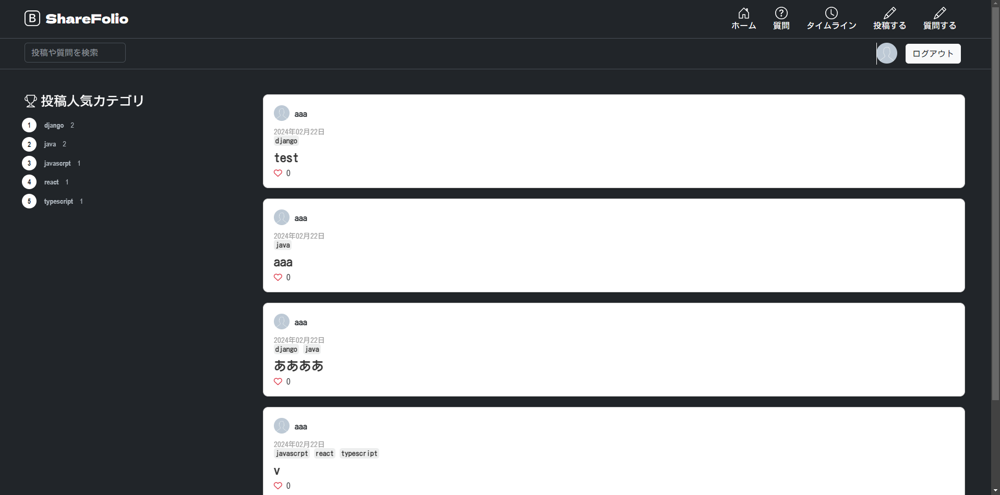
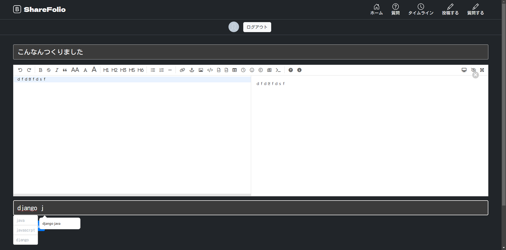
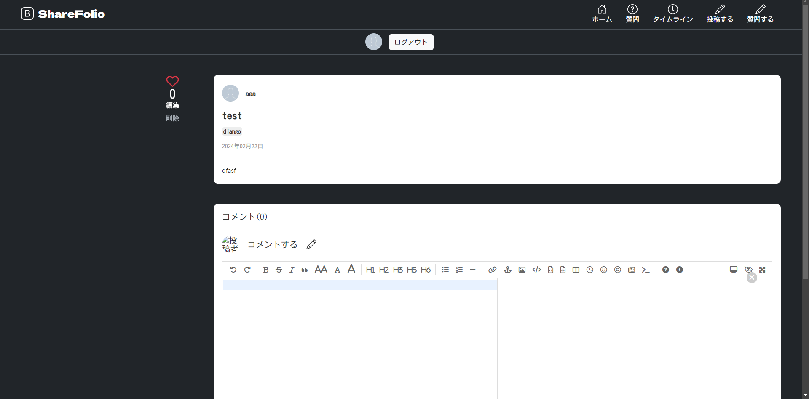
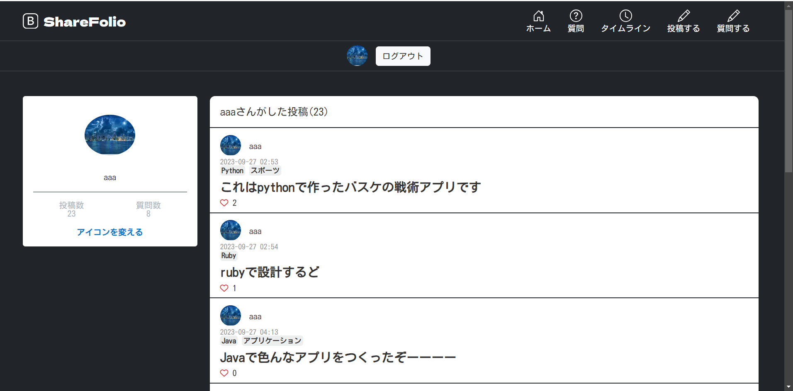

# 個人開発物をShareできるアプリ「ShaFolio」

**めちゃめちゃQiitaに似せて作りました。何も言わないでください。**

### ログインページ

### ホーム
みんなが投稿した投稿と上位タグを閲覧できます。

### 投稿画面
markdownで投稿ができ、タグを自分で空白区切りで指定できます。
既ににあるタグであれば、suggestしてくれます。

### 投稿詳細
各投稿の詳細画面が見れます。いいね・コメントができます。

### プロフィール
自分が投稿した記事といいねした記事が閲覧でき、プロフィールアイコンを変えることができます。

